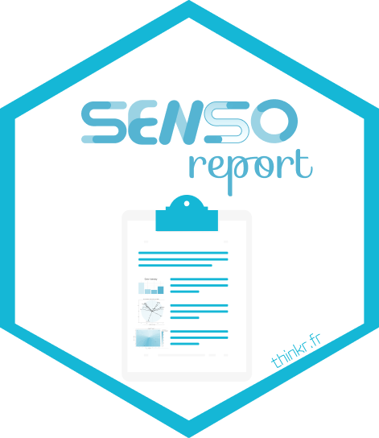

<!-- README.md is generated from README.Rmd. Please edit that file -->

# sensoreport 

<!-- badges: start -->

<!-- badges: end -->

{sensoreport} is a *demo* Shiny application dedicated to the creation of
**automated**, **reproducible**, **interactive** and **ready-to-share**
sensory/consumer reports.

Such tool can enable sensory analysts and panel leaders to spend less
time preparing reports, and add more value to their work.

## When software development meets sensory sciences to create and share ad-hoc reproducible sensory reports: Opportunities & challenges

## Demo app

The app is available here: <https://connect.thinkr.fr/sensoreport/>

## Highlights

- Robust tool thanks to unit tests
- Versioned tool
- Documented tool
- Continuously deployed tool (each modification to the code
  automatically triggers deployment of the app in production)
- Automated and industrialized workflow
- Seamless workflow for the users (sensory analysts and panel leaders)

## User guide

- Specify your name
- Choose a toy session
- Select the products you want to include in the report
- Run the report
- Visualize the report and download it if you want

## Development

- `{fusen}` to create, document and test business functions (sensory
  mapping, preference mapping, etc.):
  <https://github.com/ThinkR-open/fusen>
- `{golem}` to create the Shiny app into a R package:
  <https://github.com/ThinkR-open/golem>
